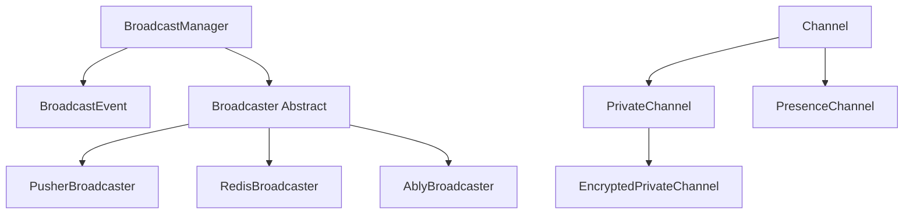

# Laravel Broadcasting 包架构设计深度分析

> 作为 PHP 架构师对 Laravel Broadcasting 包源码的深入分析，重点关注实时通信系统的设计模式、SOLID 原则实现和扩展性设计。

## 目录

1. [概述](#概述)
2. [Broadcasting 包结构分析](#broadcasting-包结构分析)
3. [核心设计模式深度分析](#核心设计模式深度分析)
4. [SOLID 原则的体现](#solid-原则的体现)
5. [扩展性设计分析](#扩展性设计分析)
6. [学习价值与实践建议](#学习价值与实践建议)

---

## 概述

Laravel Broadcasting 包是实现实时 Web 应用的核心组件，它提供了一个优雅的 API 来广播服务器端事件到客户端。通过对 `vendor/laravel/framework/src/Illuminate/Broadcasting/` 目录的深入分析，我们可以发现这个包在架构设计上的精妙之处。

### Broadcasting 包的核心职责

1. **事件广播**: 将服务器端事件实时推送到客户端
2. **频道认证**: 管理私有和存在频道的用户认证
3. **多驱动支持**: 支持 Pusher、Redis、Ably 等多种广播服务
4. **队列集成**: 与 Laravel 队列系统无缝集成

---

## Broadcasting 包结构分析

### 整体架构图

```
vendor/laravel/framework/src/Illuminate/Broadcasting/
├── BroadcastManager.php          # 核心管理器（工厂模式）
├── BroadcastEvent.php           # 事件包装器（装饰器模式）
├── BroadcastServiceProvider.php # 服务提供者
├── Channel.php                  # 频道基类
├── PrivateChannel.php           # 私有频道
├── PresenceChannel.php          # 存在频道
├── EncryptedPrivateChannel.php  # 加密私有频道
├── BroadcastController.php      # HTTP 控制器
├── PendingBroadcast.php         # 待发送广播
├── AnonymousEvent.php           # 匿名事件
└── Broadcasters/                # 广播器实现
    ├── Broadcaster.php          # 抽象基类（模板方法）
    ├── PusherBroadcaster.php    # Pusher 实现（策略模式）
    ├── RedisBroadcaster.php     # Redis 实现（策略模式）
    ├── AblyBroadcaster.php      # Ably 实现（策略模式）
    ├── LogBroadcaster.php       # 日志实现
    ├── NullBroadcaster.php      # 空对象实现
    └── UsePusherChannelConventions.php # 共享行为（Trait）
```

### 核心组件关系



---

## 核心设计模式深度分析

### 1. 工厂模式（Factory Pattern） ⭐⭐⭐⭐⭐

#### 概念解释
BroadcastManager 作为工厂类，根据配置创建不同类型的广播器实例，封装了复杂的对象创建逻辑。

#### 具体实现位置
- **工厂类**: `vendor/laravel/framework/src/Illuminate/Broadcasting/BroadcastManager.php`
- **工厂契约**: `vendor/laravel/framework/src/Illuminate/Contracts/Broadcasting/Factory.php`

#### 代码示例分析

```php
// BroadcastManager.php 工厂模式核心实现
class BroadcastManager implements FactoryContract
{
    protected $drivers = [];
    protected $customCreators = [];
    
    /**
     * 工厂方法 - 获取广播器实例
     */
    public function connection($driver = null)
    {
        return $this->driver($driver);
    }
    
    public function driver($name = null)
    {
        $name = $name ?: $this->getDefaultDriver();
        return $this->drivers[$name] = $this->get($name);
    }
    
    /**
     * 解析广播器 - 工厂模式的核心逻辑
     */
    protected function resolve($name)
    {
        $config = $this->getConfig($name);
        
        // 检查自定义创建器
        if (isset($this->customCreators[$config['driver']])) {
            return $this->callCustomCreator($config);
        }
        
        // 动态调用创建方法
        $driverMethod = 'create'.ucfirst($config['driver']).'Driver';
        
        if (! method_exists($this, $driverMethod)) {
            throw new InvalidArgumentException("Driver [{$config['driver']}] is not supported.");
        }
        
        return $this->{$driverMethod}($config);
    }
    
    /**
     * 创建 Pusher 广播器
     */
    protected function createPusherDriver(array $config)
    {
        $pusher = new Pusher(
            $config['key'], $config['secret'],
            $config['app_id'], $config['options'] ?? []
        );
        
        return new PusherBroadcaster($pusher);
    }
    
    /**
     * 创建 Redis 广播器
     */
    protected function createRedisDriver(array $config)
    {
        return new RedisBroadcaster(
            $this->app->make('redis'),
            $config['connection'] ?? null,
            $this->app['config']->get('database.redis.prefix', '')
        );
    }
}
```

#### 设计优势
1. **统一接口**: 通过相同的接口获取不同类型的广播器
2. **延迟实例化**: 只有在需要时才创建实例
3. **配置驱动**: 基于配置文件动态选择实现
4. **可扩展性**: 支持注册自定义广播器

---

### 2. 策略模式（Strategy Pattern） ⭐⭐⭐⭐⭐

#### 概念解释
不同的广播器实现了相同的接口，但采用不同的广播策略，客户端可以在运行时切换广播策略。

#### 具体实现位置
- **策略接口**: `vendor/laravel/framework/src/Illuminate/Contracts/Broadcasting/Broadcaster.php`
- **抽象策略**: `vendor/laravel/framework/src/Illuminate/Broadcasting/Broadcasters/Broadcaster.php`
- **具体策略**: `PusherBroadcaster.php`, `RedisBroadcaster.php`, `AblyBroadcaster.php`

#### 代码示例分析

```php
// Broadcaster Contract - 策略接口
interface Broadcaster
{
    public function auth($request);
    public function validAuthenticationResponse($request, $result);
    public function broadcast(array $channels, $event, array $payload = []);
}

// PusherBroadcaster - 具体策略实现
class PusherBroadcaster extends Broadcaster
{
    protected $pusher;
    
    public function __construct(Pusher $pusher)
    {
        $this->pusher = $pusher;
    }
    
    /**
     * Pusher 特定的广播实现
     */
    public function broadcast(array $channels, $event, array $payload = [])
    {
        $socket = Arr::pull($payload, 'socket');
        
        $response = $this->pusher->trigger(
            $this->formatChannels($channels), $event, $payload, $socket
        );
        
        if ((is_array($response) && $response['status'] >= 200 && $response['status'] <= 299)
            || $response === true) {
            return;
        }
        
        throw new BroadcastException(
            is_bool($response) ? 'Failed to connect to Pusher.' : $response['body']
        );
    }
}

// RedisBroadcaster - 另一种策略实现
class RedisBroadcaster extends Broadcaster
{
    protected $redis;
    protected $connection;
    
    public function __construct(Redis $redis, $connection = null, $prefix = '')
    {
        $this->redis = $redis;
        $this->connection = $connection;
        $this->prefix = $prefix;
    }
    
    /**
     * Redis 特定的广播实现
     */
    public function broadcast(array $channels, $event, array $payload = [])
    {
        $connection = $this->redis->connection($this->connection);
        
        $payload = json_encode([
            'event' => $event,
            'data' => $payload,
            'socket' => Arr::pull($payload, 'socket'),
        ]);
        
        foreach ($this->formatChannels($channels) as $channel) {
            $connection->publish($this->prefix.$channel, $payload);
        }
    }
}
```

#### 设计优势
1. **算法封装**: 每种广播策略独立封装
2. **运行时切换**: 可以根据配置动态选择策略
3. **易于扩展**: 添加新的广播服务只需实现接口
4. **职责分离**: 每个策略只关注自己的实现细节

---

### 3. 模板方法模式（Template Method Pattern） ⭐⭐⭐⭐

#### 概念解释
抽象 Broadcaster 类定义了广播流程的骨架，子类实现具体的步骤，确保了统一的处理流程。

#### 具体实现位置
- **模板类**: `vendor/laravel/framework/src/Illuminate/Broadcasting/Broadcasters/Broadcaster.php`

#### 代码示例分析

```php
// Broadcaster.php - 模板方法模式实现
abstract class Broadcaster implements BroadcasterContract
{
    protected $channels = [];
    protected $channelOptions = [];
    
    /**
     * 模板方法 - 定义频道认证流程
     */
    public function auth($request)
    {
        // 第一步：规范化频道名称
        $channelName = $this->normalizeChannelName($request->channel_name);
        
        // 第二步：检查频道是否为空或需要守护
        if (empty($request->channel_name) ||
            ($this->isGuardedChannel($request->channel_name) &&
            ! $this->retrieveUser($request, $channelName))) {
            throw new AccessDeniedHttpException;
        }
        
        // 第三步：验证用户访问权限（子类可重写）
        return $this->verifyUserCanAccessChannel($request, $channelName);
    }
    
    /**
     * 验证用户访问权限 - 模板方法的一个步骤
     */
    protected function verifyUserCanAccessChannel($request, $channelName)
    {
        foreach ($this->extractAuthParameters($channelName, $request) as $parameter) {
            $_instance = $this->resolveBinding($parameter['key'], $parameter['value'], 
                                                $parameter['callbackParameters']);
            $parameters[] = $_instance;
        }
        
        $callback = $this->normalizeChannelHandlerToCallable($channelName);
        
        if (! $callback) {
            return false;
        }
        
        $result = $this->callChannelCallback($callback, $parameters);
        
        return $this->validAuthenticationResponse($request, $result);
    }
    
    /**
     * 抽象方法 - 子类必须实现
     */
    abstract public function validAuthenticationResponse($request, $result);
    
    /**
     * 钩子方法 - 子类可以重写
     */
    protected function normalizeChannelName($channelName)
    {
        return str_replace(['private-', 'presence-'], '', $channelName);
    }
}
```

#### 设计优势
1. **流程统一**: 所有广播器都遵循相同的认证流程
2. **灵活定制**: 子类可以重写特定步骤
3. **代码复用**: 通用逻辑在基类中实现
4. **扩展性**: 新的广播器只需实现关键方法

---

### 4. 装饰器模式（Decorator Pattern） ⭐⭐⭐⭐

#### 概念解释
BroadcastEvent 类作为装饰器，包装原始事件对象，为其添加队列处理能力和广播功能。

#### 具体实现位置
- **装饰器类**: `vendor/laravel/framework/src/Illuminate/Broadcasting/BroadcastEvent.php`

#### 代码示例分析

```php
// BroadcastEvent.php - 装饰器模式实现
class BroadcastEvent implements ShouldQueue
{
    use Queueable;
    
    /**
     * 被装饰的原始事件
     */
    public $event;
    
    // 队列相关属性
    public $tries;
    public $timeout;
    public $backoff;
    public $maxExceptions;
    
    /**
     * 装饰器构造函数 - 包装原始事件
     */
    public function __construct($event)
    {
        $this->event = $event;
        
        // 从原始事件继承队列属性
        $this->tries = property_exists($event, 'tries') ? $event->tries : null;
        $this->timeout = property_exists($event, 'timeout') ? $event->timeout : null;
        $this->backoff = property_exists($event, 'backoff') ? $event->backoff : null;
        $this->maxExceptions = property_exists($event, 'maxExceptions') ? $event->maxExceptions : null;
    }
    
    /**
     * 装饰器的核心方法 - 添加广播功能
     */
    public function handle(BroadcastingFactory $manager)
    {
        // 获取事件名称
        $name = method_exists($this->event, 'broadcastAs')
                ? $this->event->broadcastAs() 
                : get_class($this->event);
        
        // 获取广播频道
        $channels = Arr::wrap($this->event->broadcastOn());
        
        if (empty($channels)) {
            return;
        }
        
        // 获取连接配置
        $connections = method_exists($this->event, 'broadcastConnections')
                            ? $this->event->broadcastConnections()
                            : [null];
        
        // 获取载荷数据
        $payload = $this->getPayloadFromEvent($this->event);
        
        // 执行广播 - 装饰器添加的核心功能
        foreach ($connections as $connection) {
            $manager->connection($connection)->broadcast(
                $this->getConnectionChannels($channels, $connection),
                $name,
                $this->getConnectionPayload($payload, $connection)
            );
        }
    }
    
    /**
     * 从事件中提取载荷数据 - 装饰器的辅助功能
     */
    protected function getPayloadFromEvent($event)
    {
        if (method_exists($event, 'broadcastWith')) {
            return array_merge(
                $event->broadcastWith(), ['socket' => data_get($event, 'socket')]
            );
        }
        
        $payload = [];
        
        foreach ((new ReflectionClass($event))->getProperties(ReflectionProperty::IS_PUBLIC) as $property) {
            $payload[$property->getName()] = $this->formatProperty($property->getValue($event));
        }
        
        unset($payload['broadcastQueue']);
        
        return $payload;
    }
}
```

#### 设计优势
1. **功能扩展**: 为原始事件添加队列和广播功能
2. **透明性**: 保持原始事件的接口不变
3. **灵活组合**: 可以动态为不同事件添加功能
4. **职责分离**: 广播逻辑与业务事件分离

---

### 5. 建造者模式（Builder Pattern） ⭐⭐⭐

#### 概念解释
通过链式调用构建复杂的频道对象，支持不同类型的频道配置。

#### 具体实现位置
- **基础建造者**: `vendor/laravel/framework/src/Illuminate/Broadcasting/Channel.php`
- **具体建造者**: `PrivateChannel.php`, `PresenceChannel.php`, `EncryptedPrivateChannel.php`

#### 代码示例分析

```php
// Channel.php - 基础频道类
class Channel implements Stringable
{
    public $name;
    
    public function __construct($name)
    {
        $this->name = $name instanceof HasBroadcastChannel 
                     ? $name->broadcastChannel() 
                     : $name;
    }
    
    public function __toString()
    {
        return $this->name;
    }
}

// PrivateChannel.php - 私有频道建造者
class PrivateChannel extends Channel
{
    public function __construct($name)
    {
        $name = $name instanceof HasBroadcastChannel 
               ? $name->broadcastChannel() 
               : $name;
        
        parent::__construct('private-'.$name);
    }
}

// PresenceChannel.php - 存在频道建造者
class PresenceChannel extends PrivateChannel
{
    public function __construct($name)
    {
        $name = $name instanceof HasBroadcastChannel 
               ? $name->broadcastChannel() 
               : $name;
        
        Channel::__construct('presence-'.$name);
    }
}

// PendingBroadcast.php - 待发送广播建造者
class PendingBroadcast
{
    protected $manager;
    protected $event;
    
    public function __construct(BroadcastingFactory $manager, $event)
    {
        $this->event = $event;
        $this->manager = $manager;
    }
    
    /**
     * 建造者方法 - 设置频道
     */
    public function on($channels)
    {
        $this->event->broadcastOn = Collection::wrap($this->event->broadcastOn)
            ->concat(Collection::wrap($channels))
            ->unique()
            ->toArray();
            
        return $this;
    }
    
    /**
     * 建造者方法 - 设置私有频道
     */
    public function toOthers()
    {
        $this->event->socket = $this->getSocketId();
        
        return $this;
    }
    
    /**
     * 构建最终产品 - 执行广播
     */
    public function toOthers()
    {
        return $this->manager->queue($this->event);
    }
}
```

#### 设计优势
1. **流畅接口**: 支持链式调用构建频道
2. **类型安全**: 不同频道类型有明确的构造逻辑
3. **配置灵活**: 可以组合不同的频道选项
4. **代码清晰**: 频道构建逻辑清晰易懂

---

### 6. 空对象模式（Null Object Pattern） ⭐⭐⭐

#### 概念解释
NullBroadcaster 提供一个"什么都不做"的广播器实现，避免了空指针检查。

#### 具体实现位置
- **空对象**: `vendor/laravel/framework/src/Illuminate/Broadcasting/Broadcasters/NullBroadcaster.php`

#### 代码示例分析

```php
// NullBroadcaster.php - 空对象模式实现
class NullBroadcaster extends Broadcaster
{
    /**
     * 空实现 - 不执行任何认证
     */
    public function auth($request)
    {
        // 什么都不做
    }
    
    /**
     * 空实现 - 返回空的认证响应
     */
    public function validAuthenticationResponse($request, $result)
    {
        return null;
    }
    
    /**
     * 空实现 - 不执行任何广播
     */
    public function broadcast(array $channels, $event, array $payload = [])
    {
        // 什么都不做
    }
}
```

#### 设计优势
1. **消除空检查**: 客户端不需要检查广播器是否为空
2. **统一接口**: 提供与真实广播器相同的接口
3. **安全默认**: 在测试或开发环境中提供安全的默认行为
4. **性能优化**: 避免不必要的网络调用

---

### 7. 观察者模式（Observer Pattern） ⭐⭐⭐⭐

#### 概念解释
Broadcasting 系统本身就是观察者模式的体现，事件发生时通知所有监听的客户端。

#### 代码示例分析

```php
// 事件定义 - 被观察的主题
class OrderShipped implements ShouldBroadcast
{
    use Dispatchable, InteractsWithSockets, SerializesModels;
    
    public $order;
    
    public function __construct(Order $order)
    {
        $this->order = $order;
    }
    
    /**
     * 定义广播频道 - 观察者订阅的频道
     */
    public function broadcastOn()
    {
        return new PrivateChannel('orders.'.$this->order->user_id);
    }
    
    /**
     * 定义广播数据 - 通知观察者的数据
     */
    public function broadcastWith()
    {
        return [
            'order_id' => $this->order->id,
            'status' => $this->order->status,
        ];
    }
}

// 客户端 JavaScript - 观察者实现
Echo.private(`orders.${userId}`)
    .listen('OrderShipped', (e) => {
        console.log('订单已发货:', e.order_id);
        // 更新 UI
    });
```

---

## SOLID 原则的体现

### 1. 单一职责原则（Single Responsibility Principle）

Broadcasting 包中每个类都有明确的单一职责：

```php
// BroadcastManager - 只负责管理和创建广播器
class BroadcastManager { /* 只管理广播器 */ }

// BroadcastEvent - 只负责包装事件并处理广播
class BroadcastEvent { /* 只处理事件广播 */ }

// Channel - 只负责表示频道
class Channel { /* 只表示频道信息 */ }

// PusherBroadcaster - 只负责 Pusher 广播逻辑
class PusherBroadcaster { /* 只处理 Pusher 广播 */ }
```

### 2. 开闭原则（Open/Closed Principle）

通过接口和抽象类支持扩展而不修改现有代码：

```php
// 接口定义规范，对修改关闭
interface Broadcaster
{
    public function auth($request);
    public function broadcast(array $channels, $event, array $payload = []);
}

// 抽象类提供通用实现，对扩展开放
abstract class Broadcaster implements BroadcasterContract
{
    // 通用实现
}

// 具体实现可以扩展，但不影响其他代码
class CustomBroadcaster extends Broadcaster
{
    // 自定义实现
}
```

### 3. 里氏替换原则（Liskov Substitution Principle）

任何使用 Broadcaster 接口的地方都可以透明地使用其任何实现：

```php
function sendBroadcast(Broadcaster $broadcaster, array $channels, $event, array $data)
{
    return $broadcaster->broadcast($channels, $event, $data);
}

// 可以透明替换使用
sendBroadcast(new PusherBroadcaster($pusher), $channels, $event, $data);
sendBroadcast(new RedisBroadcaster($redis), $channels, $event, $data);
sendBroadcast(new NullBroadcaster(), $channels, $event, $data);
```

### 4. 接口隔离原则（Interface Segregation Principle）

Broadcasting 包将接口分解为多个专门的小接口：

```php
// 工厂接口 - 只负责创建广播器
interface Factory
{
    public function connection($name = null);
}

// 广播器接口 - 只负责广播功能
interface Broadcaster
{
    public function auth($request);
    public function broadcast(array $channels, $event, array $payload = []);
}

// 可广播接口 - 只定义广播能力
interface ShouldBroadcast
{
    public function broadcastOn();
}
```

### 5. 依赖倒置原则（Dependency Inversion Principle）

高层模块依赖抽象而不是具体实现：

```php
// BroadcastManager 依赖抽象而不是具体实现
class BroadcastManager implements FactoryContract
{
    protected $app; // 依赖容器抽象
    
    public function __construct(Container $app) // 依赖注入抽象
    {
        $this->app = $app;
    }
}

// BroadcastEvent 依赖工厂抽象
class BroadcastEvent
{
    public function handle(BroadcastingFactory $manager) // 依赖抽象
    {
        $manager->connection($connection)->broadcast($channels, $name, $payload);
    }
}
```

---

## 扩展性设计分析

### 1. 自定义广播器扩展

```php
// 创建自定义广播器
class WebSocketBroadcaster extends Broadcaster
{
    protected $webSocketServer;
    
    public function __construct(WebSocketServer $server)
    {
        $this->webSocketServer = $server;
    }
    
    public function broadcast(array $channels, $event, array $payload = [])
    {
        foreach ($channels as $channel) {
            $this->webSocketServer->broadcast($channel, [
                'event' => $event,
                'data' => $payload,
            ]);
        }
    }
    
    public function auth($request)
    {
        // 自定义认证逻辑
        return parent::verifyUserCanAccessChannel($request, $channelName);
    }
    
    public function validAuthenticationResponse($request, $result)
    {
        return ['authenticated' => true];
    }
}

// 在服务提供者中注册自定义广播器
class AppServiceProvider extends ServiceProvider
{
    public function boot()
    {
        Broadcast::extend('websocket', function ($app, $config) {
            return new WebSocketBroadcaster(
                $app->make(WebSocketServer::class)
            );
        });
    }
}
```

### 2. 中间件扩展机制

```php
// 自定义广播中间件
class BroadcastRateLimitMiddleware
{
    public function handle($request, Closure $next)
    {
        if ($this->tooManyAttempts($request)) {
            return response('Too Many Requests', 429);
        }
        
        return $next($request);
    }
    
    protected function tooManyAttempts($request)
    {
        // 实现频率限制逻辑
    }
}

// 应用中间件
Route::middleware([BroadcastRateLimitMiddleware::class])
    ->post('/broadcasting/auth', [BroadcastController::class, 'authenticate']);
```

### 3. 事件变换器扩展

```php
// 自定义事件变换器
class EncryptedBroadcastEvent extends BroadcastEvent
{
    protected function getPayloadFromEvent($event)
    {
        $payload = parent::getPayloadFromEvent($event);
        
        // 加密敏感数据
        if (method_exists($event, 'shouldEncryptBroadcastData')) {
            $payload = $this->encryptPayload($payload);
        }
        
        return $payload;
    }
    
    protected function encryptPayload(array $payload)
    {
        return array_map(function ($value) {
            return is_string($value) ? encrypt($value) : $value;
        }, $payload);
    }
}
```

### 4. 频道路由扩展

```php
// 自定义频道路由
class ModelChannel implements HasBroadcastChannel
{
    protected $model;
    
    public function __construct($model)
    {
        $this->model = $model;
    }
    
    public function broadcastChannel()
    {
        return get_class($this->model).'.'.($this->model->getKey() ?? 'new');
    }
    
    public function broadcastChannelRoute()
    {
        return 'model.'.strtolower(class_basename($this->model)).'.{id}';
    }
}

// 使用自定义频道
class UserUpdated implements ShouldBroadcast
{
    public function broadcastOn()
    {
        return new ModelChannel($this->user);
    }
}
```

---

## 学习价值与实践建议

### 按重要性和学习价值排序：

1. **⭐⭐⭐⭐⭐ 工厂模式** - BroadcastManager 的核心设计模式
2. **⭐⭐⭐⭐⭐ 策略模式** - 多广播器实现的基础
3. **⭐⭐⭐⭐ 模板方法模式** - 统一广播流程的关键
4. **⭐⭐⭐⭐ 装饰器模式** - 事件增强的优雅实现
5. **⭐⭐⭐ 建造者模式** - 频道构建的灵活方案
6. **⭐⭐⭐ 空对象模式** - 避免空检查的优雅解决方案
7. **⭐⭐⭐⭐ 观察者模式** - 实时通信的核心理念

### 实践建议：

#### 1. 实现自定义广播驱动
```php
// 创建企业微信广播器
class WeChatWorkBroadcaster extends Broadcaster
{
    protected $client;
    
    public function broadcast(array $channels, $event, array $payload = [])
    {
        foreach ($channels as $channel) {
            $this->client->sendGroupMessage($channel, [
                'msgtype' => 'text',
                'text' => ['content' => json_encode($payload)]
            ]);
        }
    }
}

// 注册驱动
Broadcast::extend('wechat-work', function ($app, $config) {
    return new WeChatWorkBroadcaster(
        new WeChatWorkClient($config)
    );
});
```

#### 2. 创建频道认证中间件
```php
class ChannelPermissionMiddleware
{
    public function handle($request, Closure $next)
    {
        $channel = $request->input('channel_name');
        $user = Auth::user();
        
        if (! $this->canAccessChannel($user, $channel)) {
            throw new AccessDeniedHttpException;
        }
        
        return $next($request);
    }
}
```

#### 3. 实现事件过滤器
```php
class ConditionalBroadcastEvent extends BroadcastEvent
{
    public function handle(BroadcastingFactory $manager)
    {
        if (method_exists($this->event, 'shouldBroadcast')) {
            if (! $this->event->shouldBroadcast()) {
                return;
            }
        }
        
        parent::handle($manager);
    }
}
```

#### 4. 构建实时分析系统
```php
class RealTimeAnalytics
{
    public function trackEvent($event, array $data)
    {
        broadcast(new AnalyticsEvent($event, $data))
            ->toOthers()
            ->on('analytics.dashboard');
    }
}

// 使用
$analytics = new RealTimeAnalytics();
$analytics->trackEvent('user.login', ['user_id' => 123]);
```

### 学习建议：

1. **深入理解工厂模式**: 掌握如何设计可扩展的对象创建机制
2. **实践策略模式**: 在自己的项目中实现可切换的算法族
3. **研究模板方法**: 学习如何设计可扩展的算法骨架
4. **应用装饰器模式**: 理解如何动态添加对象功能
5. **理解观察者模式**: 掌握事件驱动架构的设计思想

### 架构设计最佳实践：

#### 1. 配置驱动设计
```php
// config/broadcasting.php
'connections' => [
    'pusher' => [
        'driver' => 'pusher',
        'key' => env('PUSHER_APP_KEY'),
        'secret' => env('PUSHER_APP_SECRET'),
        'app_id' => env('PUSHER_APP_ID'),
    ],
    'redis' => [
        'driver' => 'redis',
        'connection' => 'default',
    ],
    'custom' => [
        'driver' => 'custom-driver',
        'endpoint' => 'https://api.custom.com',
    ],
],
```

#### 2. 接口优先设计
```php
// 先定义接口
interface CustomBroadcaster extends Broadcaster
{
    public function getConnectionStatus();
    public function getStatistics();
}

// 再实现具体类
class MyCustomBroadcaster extends Broadcaster implements CustomBroadcaster
{
    // 实现接口方法
}
```

#### 3. 事件驱动架构
```php
// 定义领域事件
class OrderStatusChanged implements ShouldBroadcast
{
    use Dispatchable, InteractsWithSockets;
    
    public function broadcastOn()
    {
        return [
            new PrivateChannel('orders.'.$this->order->user_id),
            new Channel('orders.status'),
        ];
    }
}

// 业务逻辑中触发
event(new OrderStatusChanged($order));
```

---

## 总结

Laravel Broadcasting 包在架构设计上的成功之处体现在：

### 1. 设计模式的恰当运用
- **工厂模式**解决了多广播器的创建和管理问题
- **策略模式**实现了算法的可替换性
- **模板方法模式**确保了处理流程的一致性
- **装饰器模式**优雅地扩展了事件功能

### 2. SOLID 原则的完美体现
- 每个类职责单一明确
- 通过抽象支持扩展而不修改
- 子类可以完全替换父类
- 接口设计精简专一
- 依赖抽象而非具体实现

### 3. 高度的可扩展性
- 支持自定义广播驱动
- 提供中间件扩展点
- 允许事件变换器定制
- 支持频道路由扩展

### 4. 优雅的 API 设计
- 流畅的链式调用接口
- 直观的配置驱动机制
- 统一的错误处理
- 丰富的扩展钩子

通过深入学习 Broadcasting 包的架构设计，我们可以将这些优秀的设计思想应用到自己的实时通信系统中，构建出高性能、可扩展、易维护的现代 Web 应用。
