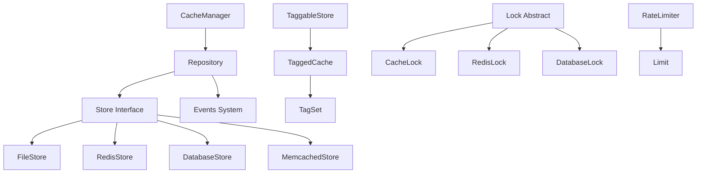

# Laravel Cache 包架构设计深度分析

> 作为 PHP 架构师对 Laravel Cache 包源码的深入分析，重点关注缓存系统的设计模式、SOLID 原则实现和扩展性设计。

## 目录

1. [概述](#概述)
2. [Cache 包结构分析](#cache-包结构分析)
3. [核心设计模式深度分析](#核心设计模式深度分析)
4. [SOLID 原则的体现](#solid-原则的体现)
5. [扩展性设计分析](#扩展性设计分析)
6. [学习价值与实践建议](#学习价值与实践建议)

---

## 概述

Laravel Cache 包是高性能缓存系统的核心组件，它提供了统一的缓存API来支持多种缓存驱动。通过对 `vendor/laravel/framework/src/Illuminate/Cache/` 目录的深入分析，我们可以发现这个包在架构设计上的卓越之处。

### Cache 包的核心职责

1. **缓存管理**: 提供统一的缓存存储和检索接口
2. **多驱动支持**: 支持 File、Redis、Database、Memcached、DynamoDB 等多种存储驱动
3. **标签缓存**: 支持基于标签的缓存分组管理
4. **分布式锁**: 提供基于缓存的分布式锁机制
5. **限流控制**: 集成高效的限流系统
6. **事件系统**: 完整的缓存操作事件监听机制

---

## Cache 包结构分析

### 整体架构图

```
vendor/laravel/framework/src/Illuminate/Cache/
├── CacheManager.php              # 核心管理器（工厂模式）
├── Repository.php                # 缓存仓储（装饰器模式）
├── CacheServiceProvider.php      # 服务提供者
├── 存储驱动 (Store Implementations)
│   ├── FileStore.php            # 文件缓存驱动（策略模式）
│   ├── RedisStore.php           # Redis 缓存驱动（策略模式）
│   ├── DatabaseStore.php        # 数据库缓存驱动（策略模式）
│   ├── MemcachedStore.php       # Memcached 缓存驱动（策略模式）
│   ├── DynamoDbStore.php        # DynamoDB 缓存驱动（策略模式）
│   ├── ArrayStore.php           # 数组缓存驱动（策略模式）
│   ├── ApcStore.php             # APC 缓存驱动（策略模式）
│   └── NullStore.php            # 空对象实现
├── 标签缓存系统 (Tagging System)
│   ├── TaggableStore.php        # 可标签存储抽象类
│   ├── TaggedCache.php          # 标签缓存（装饰器模式）
│   ├── TagSet.php               # 标签集合
│   └── RedisTaggedCache.php     # Redis 标签缓存
├── 锁机制 (Locking System)
│   ├── Lock.php                 # 锁抽象基类（模板方法模式）
│   ├── CacheLock.php            # 缓存锁
│   ├── RedisLock.php            # Redis 锁
│   ├── DatabaseLock.php         # 数据库锁
│   ├── MemcachedLock.php        # Memcached 锁
│   ├── FileLock.php             # 文件锁
│   ├── ArrayLock.php            # 数组锁
│   └── NoLock.php               # 无锁实现
├── 限流系统 (Rate Limiting)
│   ├── RateLimiter.php          # 限流器
│   └── RateLimiting/
│       ├── Limit.php            # 限制规则
│       ├── GlobalLimit.php      # 全局限制
│       └── Unlimited.php        # 无限制
├── 事件系统 (Events)
│   ├── CacheEvent.php           # 缓存事件基类
│   ├── CacheHit.php             # 缓存命中事件
│   ├── CacheMissed.php          # 缓存未命中事件
│   ├── KeyWritten.php           # 写入事件
│   ├── KeyForgotten.php         # 删除事件
│   └── ...                      # 其他事件
└── 工具组件 (Utilities)
    ├── RetrievesMultipleKeys.php # 批量检索Trait
    ├── HasCacheLock.php         # 锁功能Trait
    ├── MemcachedConnector.php   # Memcached连接器
    ├── ApcWrapper.php           # APC包装器
    └── LuaScripts.php           # Redis Lua脚本
```

### 核心组件关系



---

## 核心设计模式深度分析

### 1. 工厂模式（Factory Pattern） ⭐⭐⭐⭐⭐

#### 概念解释
CacheManager 作为工厂类，根据配置创建不同类型的缓存存储实例，封装了复杂的存储驱动创建逻辑。

#### 具体实现位置
- **工厂类**: `vendor/laravel/framework/src/Illuminate/Cache/CacheManager.php`
- **工厂契约**: `vendor/laravel/framework/src/Illuminate/Contracts/Cache/Factory.php`

#### 代码示例分析

```php
// CacheManager.php 工厂模式核心实现
class CacheManager implements FactoryContract
{
    protected $stores = [];
    protected $customCreators = [];
    
    /**
     * 工厂方法 - 获取缓存存储实例
     */
    public function store($name = null)
    {
        $name = $name ?: $this->getDefaultDriver();
        
        return $this->stores[$name] ??= $this->resolve($name);
    }
    
    /**
     * 解析缓存存储 - 工厂模式的核心逻辑
     */
    public function resolve($name)
    {
        $config = $this->getConfig($name);
        
        if (is_null($config)) {
            throw new InvalidArgumentException("Cache store [{$name}] is not defined.");
        }
        
        return $this->build($config);
    }
    
    /**
     * 构建缓存仓储 - 包装Store为Repository
     */
    public function build(array $config)
    {
        if (isset($this->customCreators[$driver = $config['driver']])) {
            return $this->callCustomCreator($driver, $config);
        }
        
        $driverMethod = 'create'.ucfirst($driver).'Driver';
        
        if (method_exists($this, $driverMethod)) {
            return $this->{$driverMethod}($config);
        }
        
        throw new InvalidArgumentException("Driver [{$driver}] is not supported.");
    }
    
    /**
     * 创建 Redis 缓存驱动
     */
    protected function createRedisDriver(array $config)
    {
        $redis = $this->app['redis'];
        
        return $this->repository(new RedisStore(
            $redis,
            $this->getPrefix($config),
            Arr::get($config, 'connection', 'default'),
            Arr::get($config, 'lock_connection')
        ));
    }
    
    /**
     * 创建文件缓存驱动
     */
    protected function createFileDriver(array $config)
    {
        return $this->repository(new FileStore(
            $this->app['files'],
            $config['path'],
            Arr::get($config, 'permission')
        ));
    }
    
    /**
     * 包装Store为Repository
     */
    public function repository(Store $store)
    {
        $repository = new Repository($store);
        
        if ($this->app->bound(DispatcherContract::class)) {
            $repository->setEventDispatcher(
                $this->app[DispatcherContract::class]
            );
        }
        
        return $repository;
    }
}
```

#### 设计优势
1. **驱动抽象**: 通过统一接口创建不同类型的缓存驱动
2. **配置驱动**: 基于配置文件动态选择实现
3. **延迟实例化**: 只有在需要时才创建实例，节省资源
4. **可扩展性**: 支持注册自定义缓存驱动

---

### 2. 策略模式（Strategy Pattern） ⭐⭐⭐⭐⭐

#### 概念解释
不同的缓存存储实现了相同的Store接口，但采用不同的存储策略，客户端可以在运行时切换存储策略。

#### 具体实现位置
- **策略接口**: `vendor/laravel/framework/src/Illuminate/Contracts/Cache/Store.php`
- **具体策略**: `FileStore.php`, `RedisStore.php`, `DatabaseStore.php`, `MemcachedStore.php`, `DynamoDbStore.php`

#### 代码示例分析

```php
// Store Contract - 策略接口
interface Store
{
    public function get($key);
    public function many(array $keys);
    public function put($key, $value, $seconds);
    public function putMany(array $values, $seconds);
    public function increment($key, $value = 1);
    public function decrement($key, $value = 1);
    public function forever($key, $value);
    public function forget($key);
    public function flush();
    public function getPrefix();
}

// FileStore - 文件存储策略
class FileStore implements Store, LockProvider
{
    use InteractsWithTime, RetrievesMultipleKeys;
    
    protected $files;
    protected $directory;
    
    public function __construct(Filesystem $files, $directory, $filePermission = null)
    {
        $this->files = $files;
        $this->directory = $directory;
        $this->filePermission = $filePermission;
    }
    
    /**
     * 文件存储特定的获取实现
     */
    public function get($key)
    {
        return $this->getPayload($key)['data'] ?? null;
    }
    
    /**
     * 文件存储特定的写入实现
     */
    public function put($key, $value, $seconds)
    {
        $this->ensureCacheDirectoryExists($path = $this->path($key));
        
        $result = $this->files->put(
            $path, $this->expiration($seconds).serialize($value), true
        );
        
        if ($result !== false && $result > 0) {
            $this->ensurePermissionsAreCorrect($path);
            return true;
        }
        
        return false;
    }
    
    /**
     * 获取缓存文件的完整载荷数据
     */
    protected function getPayload($key)
    {
        $path = $this->path($key);
        
        // Lock the file for reading...
        try {
            $file = new LockableFile($path, 'r');
        } catch (Exception $e) {
            return $this->emptyPayload();
        }
        
        try {
            $file->lock();
            
            $expire = substr($contents = $file->read(), 0, 10);
        } finally {
            $file->close();
        }
        
        // 检查过期时间
        if ($this->currentTime() >= $expire) {
            $this->forget($key);
            return $this->emptyPayload();
        }
        
        try {
            $data = unserialize(substr($contents, 10));
        } catch (Exception $e) {
            $this->forget($key);
            return $this->emptyPayload();
        }
        
        return compact('data', 'time' => $expire);
    }
}

// RedisStore - Redis 存储策略
class RedisStore extends TaggableStore implements LockProvider
{
    use RetrievesMultipleKeys;
    
    protected $redis;
    protected $prefix;
    protected $connection;
    
    public function __construct(Redis $redis, $prefix = '', $connection = 'default')
    {
        $this->redis = $redis;
        $this->setPrefix($prefix);
        $this->setConnection($connection);
    }
    
    /**
     * Redis 特定的获取实现
     */
    public function get($key)
    {
        $connection = $this->connection();
        $value = $connection->get($this->prefix.$key);
        
        return ! is_null($value) 
               ? $this->connectionAwareUnserialize($value, $connection) 
               : null;
    }
    
    /**
     * Redis 特定的写入实现
     */
    public function put($key, $value, $seconds)
    {
        $connection = $this->connection();
        
        return (bool) $connection->setex(
            $this->prefix.$key,
            (int) max(1, $seconds),
            $this->connectionAwareSerialize($value, $connection)
        );
    }
    
    /**
     * Redis 特定的批量写入实现
     */
    public function putMany(array $values, $seconds)
    {
        $connection = $this->connection();
        
        $manyResult = null;
        
        $connection->multi();
        
        foreach ($values as $key => $value) {
            $result = $connection->setex(
                $this->prefix.$key,
                (int) max(1, $seconds),
                $this->connectionAwareSerialize($value, $connection)
            );
            
            $manyResult = is_null($manyResult) ? $result : $result && $manyResult;
        }
        
        $connection->exec();
        
        return (bool) $manyResult;
    }
}

// DatabaseStore - 数据库存储策略
class DatabaseStore implements Store, LockProvider
{
    use InteractsWithTime, RetrievesMultipleKeys;
    
    protected $connection;
    protected $table;
    protected $prefix;
    
    /**
     * 数据库特定的获取实现
     */
    public function get($key)
    {
        $prefixed = $this->prefix.$key;
        
        $cache = $this->table()->where('key', '=', $prefixed)->first();
        
        if (is_null($cache)) {
            return null;
        }
        
        if ($this->currentTime() >= $cache->expiration) {
            $this->forget($key);
            return null;
        }
        
        return unserialize($cache->value);
    }
    
    /**
     * 数据库特定的写入实现
     */
    public function put($key, $value, $seconds)
    {
        $key = $this->prefix.$key;
        $value = serialize($value);
        $expiration = $this->getTime() + $seconds;
        
        try {
            return $this->table()->insert(compact('key', 'value', 'expiration'));
        } catch (Exception $e) {
            $updated = $this->table()
                           ->where('key', $key)
                           ->update(compact('value', 'expiration'));
            
            return $updated > 0;
        }
    }
}
```

#### 设计优势
1. **存储抽象**: 每种存储策略独立封装实现细节
2. **运行时切换**: 可以根据配置动态选择存储策略
3. **性能优化**: 每种存储针对其特性进行了优化
4. **易于扩展**: 添加新的存储类型只需实现Store接口

---

### 3. 装饰器模式（Decorator Pattern） ⭐⭐⭐⭐⭐

#### 概念解释
Repository 类作为装饰器，包装Store实现，为其添加事件调度、锁机制、辅助方法等额外功能。TaggedCache 进一步装饰Repository，添加标签功能。

#### 具体实现位置
- **基础装饰器**: `vendor/laravel/framework/src/Illuminate/Cache/Repository.php`
- **标签装饰器**: `vendor/laravel/framework/src/Illuminate/Cache/TaggedCache.php`

#### 代码示例分析

```php
// Repository.php - 基础装饰器实现
class Repository implements ArrayAccess, CacheContract
{
    use InteractsWithTime, Macroable;
    
    /**
     * 被装饰的Store实现
     */
    protected $store;
    
    /**
     * 事件调度器 - 装饰器添加的功能
     */
    protected $events;
    
    protected $default = 3600;
    protected $config = [];
    
    public function __construct(Store $store, array $config = [])
    {
        $this->store = $store;
        $this->config = $config;
    }
    
    /**
     * 装饰器方法 - 添加事件和便捷功能
     */
    public function get($key, $default = null)
    {
        if (is_array($key)) {
            return $this->many($key);
        }
        
        // 触发获取事件
        $this->event(new RetrievingKey($this->getName(), $key));
        
        $value = $this->store->get($this->itemKey($key));
        
        // 根据结果触发不同事件
        if (is_null($value)) {
            $this->event(new CacheMissed($this->getName(), $key));
            $value = value($default);
        } else {
            $this->event(new CacheHit($this->getName(), $key, $value));
        }
        
        return $value;
    }
    
    /**
     * 装饰器方法 - 记住回调结果
     */
    public function remember($key, $ttl, Closure $callback)
    {
        $value = $this->get($key);
        
        if (! is_null($value)) {
            return $value;
        }
        
        $value = $callback();
        
        $this->put($key, $value, $ttl);
        
        return $value;
    }
    
    /**
     * 装饰器方法 - 永久记住回调结果
     */
    public function rememberForever($key, Closure $callback)
    {
        $value = $this->get($key);
        
        if (! is_null($value)) {
            return $value;
        }
        
        $this->forever($key, $value = $callback());
        
        return $value;
    }
    
    /**
     * 装饰器方法 - 添加分布式锁功能
     */
    public function lock($name, $seconds = null, $owner = null)
    {
        if ($this->store instanceof LockProvider) {
            return $this->store->lock($name, $seconds, $owner);
        }
        
        throw new BadMethodCallException('This cache store does not support locks.');
    }
    
    /**
     * 装饰器方法 - 添加事件调度
     */
    protected function event($event)
    {
        if (isset($this->events)) {
            $this->events->dispatch($event);
        }
    }
    
    /**
     * 委托调用到Store - 装饰器的核心机制
     */
    public function __call($method, $parameters)
    {
        if (static::hasMacro($method)) {
            return $this->macroCall($method, $parameters);
        }
        
        return $this->store->{$method}(...$parameters);
    }
}

// TaggedCache.php - 标签装饰器实现
class TaggedCache extends Repository
{
    use RetrievesMultipleKeys;
    
    /**
     * 标签集合 - 装饰器添加的功能
     */
    protected $tags;
    
    public function __construct(Store $store, TagSet $tags)
    {
        parent::__construct($store);
        $this->tags = $tags;
    }
    
    /**
     * 装饰器方法 - 为键添加标签前缀
     */
    public function increment($key, $value = 1)
    {
        return $this->store->increment($this->itemKey($key), $value);
    }
    
    /**
     * 装饰器方法 - 通过标签清空缓存
     */
    public function flush()
    {
        $this->tags->reset();
        
        return true;
    }
    
    /**
     * 装饰器方法 - 生成带标签的键
     */
    protected function itemKey($key)
    {
        return $this->taggedItemKey($key);
    }
    
    /**
     * 生成标签化的键名
     */
    public function taggedItemKey($key)
    {
        return sha1($this->tags->getNamespace()).':'.$key;
    }
}
```

#### 设计优势
1. **功能分层**: 通过装饰器层次化地添加功能
2. **职责分离**: Store专注存储，Repository添加业务逻辑
3. **透明性**: 保持底层Store接口的完整性
4. **可组合性**: 可以灵活组合不同的装饰器

---

### 4. 模板方法模式（Template Method Pattern） ⭐⭐⭐⭐

#### 概念解释
Lock抽象类定义了分布式锁的操作骨架，子类实现具体的获取和释放逻辑，确保了统一的锁操作流程。

#### 具体实现位置
- **模板类**: `vendor/laravel/framework/src/Illuminate/Cache/Lock.php`
- **具体实现**: `CacheLock.php`, `RedisLock.php`, `DatabaseLock.php`, `MemcachedLock.php`

#### 代码示例分析

```php
// Lock.php - 模板方法模式实现
abstract class Lock implements LockContract
{
    use InteractsWithTime;
    
    protected $name;
    protected $seconds;
    protected $owner;
    protected $sleepMilliseconds = 250;
    
    public function __construct($name, $seconds, $owner = null)
    {
        $this->name = $name;
        $this->owner = $owner ?: Str::random();
        $this->seconds = $seconds;
    }
    
    /**
     * 抽象方法 - 子类必须实现
     */
    abstract public function acquire();
    abstract public function release();
    abstract protected function getCurrentOwner();
    
    /**
     * 模板方法 - 定义锁的获取流程
     */
    public function get($callback = null)
    {
        $result = $this->acquire();
        
        if ($result && is_callable($callback)) {
            try {
                return $callback();
            } finally {
                $this->release();
            }
        }
        
        return $result;
    }
    
    /**
     * 模板方法 - 定义阻塞获取锁的流程
     */
    public function block($seconds, $callback = null)
    {
        $starting = $this->currentTime();
        
        while (! $this->acquire()) {
            usleep($this->sleepMilliseconds * 1000);
            
            if ($this->currentTime() - $seconds >= $starting) {
                throw new LockTimeoutException;
            }
        }
        
        if (is_callable($callback)) {
            try {
                return $callback();
            } finally {
                $this->release();
            }
        }
        
        return true;
    }
    
    /**
     * 模板方法 - 检查锁的所有权
     */
    public function isOwnedByCurrentProcess()
    {
        return $this->getCurrentOwner() === $this->owner;
    }
    
    /**
     * 钩子方法 - 子类可以重写
     */
    protected function sleepMilliseconds($milliseconds)
    {
        $this->sleepMilliseconds = $milliseconds;
        
        return $this;
    }
}

// RedisLock.php - Redis锁的具体实现
class RedisLock extends Lock
{
    protected $redis;
    
    public function __construct($redis, $name, $seconds, $owner = null)
    {
        parent::__construct($name, $seconds, $owner);
        $this->redis = $redis;
    }
    
    /**
     * Redis特定的获取锁实现
     */
    public function acquire()
    {
        if ($this->seconds > 0) {
            return $this->redis->set($this->name, $this->owner, 'EX', $this->seconds, 'NX');
        } else {
            return $this->redis->setnx($this->name, $this->owner);
        }
    }
    
    /**
     * Redis特定的释放锁实现
     */
    public function release()
    {
        return (bool) $this->redis->eval(
            LuaScripts::releaseLock(),
            1,
            $this->name,
            $this->owner
        );
    }
    
    /**
     * 获取当前锁的拥有者
     */
    protected function getCurrentOwner()
    {
        return $this->redis->get($this->name);
    }
}

// DatabaseLock.php - 数据库锁的具体实现
class DatabaseLock extends Lock
{
    protected $connection;
    protected $table;
    
    /**
     * 数据库特定的获取锁实现
     */
    public function acquire()
    {
        $acquired = false;
        
        try {
            $this->connection->table($this->table)->insert([
                'key' => $this->name,
                'owner' => $this->owner,
                'expiration' => $this->expiresAt(),
            ]);
            
            $acquired = true;
        } catch (QueryException $e) {
            $updated = $this->connection->table($this->table)
                ->where('key', $this->name)
                ->where('expiration', '<=', $this->currentTime())
                ->update([
                    'owner' => $this->owner,
                    'expiration' => $this->expiresAt(),
                ]);
                
            $acquired = $updated >= 1;
        }
        
        return $acquired;
    }
    
    /**
     * 数据库特定的释放锁实现
     */
    public function release()
    {
        if ($this->isOwnedByCurrentProcess()) {
            $deleted = $this->connection->table($this->table)
                ->where('key', $this->name)
                ->where('owner', $this->owner)
                ->delete();
                
            return $deleted >= 1;
        }
        
        return false;
    }
}
```

#### 设计优势
1. **流程统一**: 所有锁实现都遵循相同的操作流程
2. **算法骨架**: 定义了分布式锁的标准算法骨架
3. **易于扩展**: 新的锁实现只需实现关键方法
4. **行为一致**: 确保不同存储的锁行为一致

---

### 5. 仓储模式（Repository Pattern） ⭐⭐⭐⭐

#### 概念解释
Repository类作为领域层和数据访问层之间的桥梁，提供了统一的缓存操作接口，封装了底层存储的复杂性。

#### 具体实现位置
- **仓储实现**: `vendor/laravel/framework/src/Illuminate/Cache/Repository.php`
- **仓储契约**: `vendor/laravel/framework/src/Illuminate/Contracts/Cache/Repository.php`

#### 代码示例分析

```php
// Repository.php - 仓储模式实现
class Repository implements ArrayAccess, CacheContract
{
    protected $store;
    protected $events;
    
    /**
     * 仓储方法 - 提供高级缓存操作
     */
    public function pull($key, $default = null)
    {
        return tap($this->get($key, $default), function () use ($key) {
            $this->forget($key);
        });
    }
    
    /**
     * 仓储方法 - 添加缓存项（如果不存在）
     */
    public function add($key, $value, $ttl = null)
    {
        $seconds = null;
        
        if ($ttl !== null) {
            $seconds = $this->getSeconds($ttl);
            
            if ($seconds <= 0) {
                return false;
            }
        }
        
        if (is_null($this->get($key))) {
            return $ttl === null ? $this->forever($key, $value) : $this->put($key, $value, $seconds);
        }
        
        return false;
    }
    
    /**
     * 仓储方法 - 原子性递增操作
     */
    public function increment($key, $value = 1)
    {
        return $this->store->increment($key, $value);
    }
    
    /**
     * 仓储方法 - 原子性递减操作  
     */
    public function decrement($key, $value = 1)
    {
        return $this->store->decrement($key, $value);
    }
    
    /**
     * 仓储方法 - 支持数组式访问
     */
    public function offsetGet($key): mixed
    {
        return $this->get($key);
    }
    
    public function offsetSet($key, $value): void
    {
        $this->put($key, $value, $this->default);
    }
    
    public function offsetUnset($key): void
    {
        $this->forget($key);
    }
    
    public function offsetExists($key): bool
    {
        return ! is_null($this->get($key));
    }
}
```

#### 设计优势
1. **抽象接口**: 为上层提供统一的缓存操作接口
2. **复杂性封装**: 隐藏底层存储的实现细节
3. **功能丰富**: 提供丰富的缓存操作方法
4. **领域驱动**: 符合领域驱动设计思想

---

### 6. 观察者模式（Observer Pattern） ⭐⭐⭐⭐

#### 概念解释
Cache系统通过事件系统实现观察者模式，在缓存操作发生时通知所有注册的监听器。

#### 具体实现位置
- **事件基类**: `vendor/laravel/framework/src/Illuminate/Cache/Events/CacheEvent.php`
- **具体事件**: `CacheHit.php`, `CacheMissed.php`, `KeyWritten.php`, `KeyForgotten.php`

#### 代码示例分析

```php
// 缓存事件定义
abstract class CacheEvent
{
    public $storeName;
    
    public function __construct($storeName)
    {
        $this->storeName = $storeName;
    }
    
    /**
     * Set the tags for the cache event.
     */
    public function setTags($tags)
    {
        $this->tags = $tags;
        
        return $this;
    }
}

// 具体事件实现
class CacheHit extends CacheEvent
{
    public $key;
    public $value;
    
    public function __construct($storeName, $key, $value, $tags = [])
    {
        parent::__construct($storeName);
        
        $this->key = $key;
        $this->value = $value;
        $this->tags = $tags;
    }
}

class KeyWritten extends CacheEvent
{
    public $key;
    public $value;
    public $seconds;
    
    public function __construct($storeName, $key, $value, $seconds = null, $tags = [])
    {
        parent::__construct($storeName);
        
        $this->key = $key;
        $this->value = $value;
        $this->seconds = $seconds;
        $this->tags = $tags;
    }
}

// 在Repository中触发事件
public function put($key, $value, $ttl = null)
{
    if (is_array($key)) {
        return $this->putMany($key, $value);
    }
    
    $seconds = $this->getSeconds($ttl);
    
    if ($seconds <= 0) {
        return $this->forget($key);
    }
    
    // 触发写入前事件
    $this->event(new WritingKey($this->getName(), $key, $value, $seconds, $this->tags ?? []));
    
    $result = $this->store->put($this->itemKey($key), $value, $seconds);
    
    if ($result) {
        // 触发写入成功事件
        $this->event(new KeyWritten($this->getName(), $key, $value, $seconds, $this->tags ?? []));
    } else {
        // 触发写入失败事件
        $this->event(new KeyWriteFailed($this->getName(), $key, $value, $seconds, $this->tags ?? []));
    }
    
    return $result;
}

// 事件监听器示例
class CacheEventListener
{
    public function onCacheHit(CacheHit $event)
    {
        Log::info("Cache hit for key: {$event->key}");
    }
    
    public function onCacheMissed(CacheMissed $event)
    {
        Log::info("Cache missed for key: {$event->key}");
    }
    
    public function onKeyWritten(KeyWritten $event)
    {
        Log::info("Cache written for key: {$event->key}");
    }
}
```

#### 设计优势
1. **松耦合**: 缓存操作和业务逻辑解耦
2. **可监控性**: 便于监控缓存的使用情况
3. **扩展性**: 可以轻松添加新的事件处理逻辑
4. **调试友好**: 便于调试和性能分析

---

### 7. 空对象模式（Null Object Pattern） ⭐⭐⭐

#### 概念解释
NullStore和NoLock提供"什么都不做"的实现，避免了空指针检查，在测试和特定场景下非常有用。

#### 具体实现位置
- **空缓存**: `vendor/laravel/framework/src/Illuminate/Cache/NullStore.php`
- **空锁**: `vendor/laravel/framework/src/Illuminate/Cache/NoLock.php`

#### 代码示例分析

```php
// NullStore.php - 空对象模式实现
class NullStore implements Store
{
    use InteractsWithTime, RetrievesMultipleKeys;
    
    protected $storeName;
    protected $config;
    
    public function __construct($storeName = 'null', array $config = [])
    {
        $this->storeName = $storeName;
        $this->config = $config;
    }
    
    /**
     * 空实现 - 始终返回null
     */
    public function get($key)
    {
        return null;
    }
    
    /**
     * 空实现 - 始终返回false
     */
    public function put($key, $value, $seconds)
    {
        return false;
    }
    
    /**
     * 空实现 - 始终返回false
     */
    public function increment($key, $value = 1)
    {
        return false;
    }
    
    /**
     * 空实现 - 始终返回false
     */
    public function forever($key, $value)
    {
        return false;
    }
    
    /**
     * 空实现 - 始终返回true
     */
    public function forget($key)
    {
        return true;
    }
    
    /**
     * 空实现 - 始终返回true
     */
    public function flush()
    {
        return true;
    }
}

// NoLock.php - 空锁实现
class NoLock extends Lock
{
    /**
     * 空锁实现 - 总是可以获取
     */
    public function acquire()
    {
        return true;
    }
    
    /**
     * 空锁实现 - 总是可以释放
     */
    public function release()
    {
        return true;
    }
    
    /**
     * 空锁实现 - 总是被当前进程拥有
     */
    protected function getCurrentOwner()
    {
        return $this->owner;
    }
}
```

#### 设计优势
1. **消除空检查**: 避免在客户端代码中进行空值检查
2. **统一接口**: 提供与真实实现相同的接口
3. **测试友好**: 在测试环境中提供安全的默认行为
4. **性能优化**: 在不需要缓存的场景下避免额外开销

---

## SOLID 原则的体现

### 1. 单一职责原则（Single Responsibility Principle）

Cache包中每个类都有明确的单一职责：

```php
// CacheManager - 只负责管理和创建缓存存储
class CacheManager { /* 只管理缓存驱动 */ }

// Repository - 只负责缓存仓储操作
class Repository { /* 只提供缓存仓储功能 */ }

// FileStore - 只负责文件存储逻辑
class FileStore { /* 只处理文件缓存 */ }

// RedisLock - 只负责Redis锁操作
class RedisLock { /* 只处理Redis分布式锁 */ }

// RateLimiter - 只负责限流控制
class RateLimiter { /* 只处理限流逻辑 */ }
```

### 2. 开闭原则（Open/Closed Principle）

通过接口和抽象类支持扩展而不修改现有代码：

```php
// Store接口定义规范，对修改关闭
interface Store
{
    public function get($key);
    public function put($key, $value, $seconds);
    public function forget($key);
}

// 抽象类提供通用实现，对扩展开放
abstract class Lock implements LockContract
{
    // 通用锁逻辑
}

// 具体实现可以扩展，但不影响其他代码
class CustomStore implements Store
{
    // 自定义存储实现
}
```

### 3. 里氏替换原则（Liskov Substitution Principle）

任何使用Store接口的地方都可以透明地使用其任何实现：

```php
function cacheData(Store $store, string $key, $value, int $ttl)
{
    return $store->put($key, $value, $ttl);
}

// 可以透明替换使用
cacheData(new FileStore($files, $path), $key, $value, $ttl);
cacheData(new RedisStore($redis, $prefix), $key, $value, $ttl);
cacheData(new DatabaseStore($connection, $table), $key, $value, $ttl);
cacheData(new NullStore(), $key, $value, $ttl);
```

### 4. 接口隔离原则（Interface Segregation Principle）

Cache包将接口分解为多个专门的小接口：

```php
// 工厂接口 - 只负责创建缓存存储
interface Factory
{
    public function store($name = null);
}

// 存储接口 - 只负责存储功能
interface Store
{
    public function get($key);
    public function put($key, $value, $seconds);
}

// 锁提供者接口 - 只负责锁功能
interface LockProvider
{
    public function lock($name, $seconds = null, $owner = null);
}

// 标签接口 - 只负责标签功能
interface TaggedCache
{
    public function tags($names);
}
```

### 5. 依赖倒置原则（Dependency Inversion Principle）

高层模块依赖抽象而不是具体实现：

```php
// CacheManager 依赖抽象而不是具体实现
class CacheManager implements FactoryContract
{
    protected $app; // 依赖容器抽象
    
    public function repository(Store $store) // 依赖Store抽象
    {
        return new Repository($store);
    }
}

// Repository 依赖抽象
class Repository implements CacheContract
{
    protected $store;  // 依赖Store抽象
    protected $events; // 依赖事件调度器抽象
    
    public function __construct(Store $store) // 依赖注入抽象
    {
        $this->store = $store;
    }
}

// TaggedCache 依赖抽象
class TaggedCache extends Repository
{
    protected $tags; // 依赖TagSet抽象
    
    public function __construct(Store $store, TagSet $tags)
    {
        parent::__construct($store);
        $this->tags = $tags;
    }
}
```

---

## 扩展性设计分析

### 1. 自定义缓存驱动扩展

```php
// 创建自定义Redis集群缓存驱动
class RedisClusterStore implements Store, LockProvider
{
    protected $redisCluster;
    protected $prefix;
    
    public function __construct(RedisCluster $cluster, $prefix = '')
    {
        $this->redisCluster = $cluster;
        $this->prefix = $prefix;
    }
    
    public function get($key)
    {
        $value = $this->redisCluster->get($this->prefix.$key);
        return $value !== false ? unserialize($value) : null;
    }
    
    public function put($key, $value, $seconds)
    {
        return $this->redisCluster->setex(
            $this->prefix.$key,
            max(1, $seconds),
            serialize($value)
        );
    }
    
    public function lock($name, $seconds = null, $owner = null)
    {
        return new RedisClusterLock($this->redisCluster, $name, $seconds, $owner);
    }
    
    // 实现其他Store方法...
}

// 在服务提供者中注册自定义驱动
class AppServiceProvider extends ServiceProvider
{
    public function boot()
    {
        Cache::extend('redis-cluster', function ($app, $config) {
            return Cache::repository(new RedisClusterStore(
                $app->make('redis.cluster'),
                $app['config']->get('cache.prefix', '')
            ));
        });
    }
}
```

### 2. 缓存事件监听器扩展

```php
// 创建缓存性能监控监听器
class CachePerformanceMonitor
{
    protected $metrics = [];
    
    public function onCacheHit(CacheHit $event)
    {
        $this->recordMetric('hit', $event->key, $event->storeName);
    }
    
    public function onCacheMissed(CacheMissed $event)
    {
        $this->recordMetric('miss', $event->key, $event->storeName);
    }
    
    public function onKeyWritten(KeyWritten $event)
    {
        $this->recordMetric('write', $event->key, $event->storeName);
        $this->recordSize($event->key, $event->value);
    }
    
    protected function recordMetric(string $type, string $key, string $store)
    {
        $this->metrics[$store][$type] = ($this->metrics[$store][$type] ?? 0) + 1;
        
        // 发送到监控系统
        app('monitoring')->increment("cache.{$type}", [
            'store' => $store,
            'key_pattern' => $this->getKeyPattern($key)
        ]);
    }
    
    public function getHitRatio(string $store): float
    {
        $hits = $this->metrics[$store]['hit'] ?? 0;
        $misses = $this->metrics[$store]['miss'] ?? 0;
        
        return $hits + $misses > 0 ? $hits / ($hits + $misses) : 0;
    }
}

// 注册监听器
Event::listen([
    CacheHit::class,
    CacheMissed::class, 
    KeyWritten::class,
], CachePerformanceMonitor::class);
```

### 3. 自定义标签缓存实现

```php
// 创建支持层级标签的缓存
class HierarchicalTagSet extends TagSet
{
    /**
     * 支持层级标签 (如: 'user', 'user.profile', 'user.profile.avatar')
     */
    public function getNamespace()
    {
        if (! is_null($this->namespace)) {
            return $this->namespace;
        }
        
        $hierarchicalIds = [];
        
        foreach ($this->names as $name) {
            $parts = explode('.', $name);
            $currentPath = '';
            
            foreach ($parts as $part) {
                $currentPath .= ($currentPath ? '.' : '') . $part;
                $hierarchicalIds[] = $this->tagId($currentPath);
            }
        }
        
        return $this->namespace = implode('|', array_unique($hierarchicalIds));
    }
    
    /**
     * 重置层级标签
     */
    public function reset()
    {
        foreach ($this->names as $name) {
            $this->resetHierarchicalTag($name);
        }
    }
    
    protected function resetHierarchicalTag($tag)
    {
        $parts = explode('.', $tag);
        $currentPath = '';
        
        foreach ($parts as $part) {
            $currentPath .= ($currentPath ? '.' : '') . $part;
            $this->resetTag($currentPath);
        }
    }
}

// 使用层级标签
Cache::tags(['user', 'user.profile'])->put('user.123.name', 'John');
Cache::tags(['user.profile'])->flush(); // 只清空用户资料相关缓存
```

### 4. 分布式锁扩展

```php
// 创建基于数据库的分布式锁
class DatabaseDistributedLock extends DatabaseLock
{
    protected $retryDelay = 100; // 毫秒
    protected $maxRetries = 50;
    
    /**
     * 支持重试的锁获取
     */
    public function acquireWithRetry(): bool
    {
        $attempts = 0;
        
        while ($attempts < $this->maxRetries) {
            if ($this->acquire()) {
                return true;
            }
            
            $attempts++;
            usleep($this->retryDelay * 1000);
            
            // 指数退避
            $this->retryDelay = min($this->retryDelay * 1.5, 1000);
        }
        
        return false;
    }
    
    /**
     * 锁续期功能
     */
    public function renew(int $additionalSeconds = null): bool
    {
        $additionalSeconds = $additionalSeconds ?: $this->seconds;
        
        $updated = $this->connection->table($this->table)
            ->where('key', $this->name)
            ->where('owner', $this->owner)
            ->update([
                'expiration' => $this->currentTime() + $additionalSeconds
            ]);
            
        return $updated > 0;
    }
}
```

### 5. 缓存预热系统

```php
// 创建缓存预热系统
class CacheWarmer
{
    protected $cache;
    protected $warmers = [];
    
    public function __construct(Repository $cache)
    {
        $this->cache = $cache;
    }
    
    /**
     * 注册预热器
     */
    public function register(string $key, callable $warmer, array $tags = [])
    {
        $this->warmers[$key] = [
            'callback' => $warmer,
            'tags' => $tags
        ];
    }
    
    /**
     * 执行预热
     */
    public function warm(array $keys = null)
    {
        $keys = $keys ?: array_keys($this->warmers);
        
        foreach ($keys as $key) {
            if (!isset($this->warmers[$key])) {
                continue;
            }
            
            $warmer = $this->warmers[$key];
            $value = $warmer['callback']();
            
            if (!empty($warmer['tags'])) {
                $this->cache->tags($warmer['tags'])->forever($key, $value);
            } else {
                $this->cache->forever($key, $value);
            }
        }
    }
    
    /**
     * 按标签预热
     */
    public function warmByTag(string $tag)
    {
        $keysToWarm = [];
        
        foreach ($this->warmers as $key => $config) {
            if (in_array($tag, $config['tags'])) {
                $keysToWarm[] = $key;
            }
        }
        
        $this->warm($keysToWarm);
    }
}

// 使用缓存预热
$warmer = new CacheWarmer(Cache::store());

$warmer->register('popular_posts', function () {
    return Post::popular()->limit(10)->get();
}, ['posts', 'homepage']);

$warmer->register('site_config', function () {
    return Config::all();
}, ['config']);

// 预热特定缓存
$warmer->warmByTag('homepage');
```

---

## 学习价值与实践建议

### 按重要性和学习价值排序：

1. **⭐⭐⭐⭐⭐ 工厂模式** - CacheManager的核心设计模式
2. **⭐⭐⭐⭐⭐ 策略模式** - 多存储驱动实现的基础
3. **⭐⭐⭐⭐⭐ 装饰器模式** - Repository和TaggedCache的精妙实现
4. **⭐⭐⭐⭐ 模板方法模式** - 分布式锁统一流程的关键
5. **⭐⭐⭐⭐ 仓储模式** - 领域驱动设计的典型应用
6. **⭐⭐⭐⭐ 观察者模式** - 事件驱动架构的体现
7. **⭐⭐⭐ 空对象模式** - 避免空检查的优雅解决方案

### 实践建议：

#### 1. 实现自定义缓存驱动
```php
// 创建内存缓存驱动（用于单机高性能场景）
class MemoryStore implements Store
{
    protected $data = [];
    protected $expiration = [];
    
    public function get($key)
    {
        if (isset($this->expiration[$key]) && time() > $this->expiration[$key]) {
            $this->forget($key);
            return null;
        }
        
        return $this->data[$key] ?? null;
    }
    
    public function put($key, $value, $seconds)
    {
        $this->data[$key] = $value;
        $this->expiration[$key] = time() + $seconds;
        return true;
    }
}

// 注册驱动
Cache::extend('memory', function ($app, $config) {
    return Cache::repository(new MemoryStore());
});
```

#### 2. 构建缓存监控系统
```php
class CacheMetrics
{
    public function track()
    {
        Event::listen('cache.*', function ($eventName, $payload) {
            $event = $payload[0];
            
            $this->recordMetric([
                'event' => class_basename($event),
                'store' => $event->storeName ?? 'unknown',
                'key' => $event->key ?? null,
                'timestamp' => now()->timestamp,
            ]);
        });
    }
    
    public function getHitRate(string $store, Carbon $since): float
    {
        // 计算命中率逻辑
    }
}
```

#### 3. 实现智能缓存策略
```php
class SmartCacheStrategy
{
    public function shouldCache(string $key, $value): bool
    {
        // 根据数据大小、访问频率等决定是否缓存
        $size = strlen(serialize($value));
        $accessCount = $this->getAccessCount($key);
        
        return $size < 1024 * 10 && $accessCount > 3;
    }
    
    public function getTTL(string $key, $value): int
    {
        // 根据数据特性动态调整TTL
        $baseTime = 3600;
        $accessFrequency = $this->getAccessFrequency($key);
        
        return $baseTime * min($accessFrequency, 10);
    }
}
```

#### 4. 构建多级缓存系统
```php
class TieredCache
{
    protected $l1Cache; // 内存缓存
    protected $l2Cache; // Redis缓存
    protected $l3Cache; // 数据库缓存
    
    public function get(string $key)
    {
        // L1: 内存缓存
        if ($value = $this->l1Cache->get($key)) {
            return $value;
        }
        
        // L2: Redis缓存
        if ($value = $this->l2Cache->get($key)) {
            $this->l1Cache->put($key, $value, 300); // 5分钟
            return $value;
        }
        
        // L3: 数据库缓存
        if ($value = $this->l3Cache->get($key)) {
            $this->l2Cache->put($key, $value, 1800); // 30分钟
            $this->l1Cache->put($key, $value, 300);  // 5分钟
            return $value;
        }
        
        return null;
    }
}
```

### 学习建议：

1. **深入理解工厂模式**: 掌握如何设计可扩展的对象创建机制
2. **实践策略模式**: 在自己的项目中实现可切换的算法族
3. **掌握装饰器模式**: 学习如何优雅地扩展对象功能
4. **理解仓储模式**: 掌握领域驱动设计的核心思想
5. **应用模板方法模式**: 学习如何设计可扩展的算法骨架

### 架构设计最佳实践：

#### 1. 配置驱动设计
```php
// config/cache.php
'stores' => [
    'file' => [
        'driver' => 'file',
        'path' => storage_path('framework/cache/data'),
        'permission' => 0644,
    ],
    'redis' => [
        'driver' => 'redis',
        'connection' => 'cache',
        'lock_connection' => 'default',
    ],
    'tiered' => [
        'driver' => 'tiered',
        'stores' => ['memory', 'redis', 'database'],
    ],
],
```

#### 2. 接口优先设计
```php
// 先定义接口
interface DistributedStore extends Store
{
    public function increment($key, $value = 1);
    public function decrement($key, $value = 1);
    public function lock($name, $seconds = null);
}

// 再实现具体类
class RedisDistributedStore extends RedisStore implements DistributedStore
{
    // 分布式存储特有方法
}
```

#### 3. 事件驱动监控
```php
// 缓存事件监控
Event::listen('cache.hit', function (CacheHit $event) {
    Metrics::increment('cache.hits', ['store' => $event->storeName]);
});

Event::listen('cache.missed', function (CacheMissed $event) {
    Metrics::increment('cache.misses', ['store' => $event->storeName]);
});
```

---

## 总结

Laravel Cache 包在架构设计上的成功之处体现在：

### 1. 设计模式的精妙运用
- **工厂模式**解决了多存储驱动的创建和管理问题
- **策略模式**实现了存储算法的可替换性
- **装饰器模式**优雅地扩展了缓存功能
- **模板方法模式**确保了分布式锁的一致性
- **仓储模式**提供了领域驱动的缓存接口

### 2. SOLID原则的完美体现
- 每个类职责单一明确
- 通过抽象支持扩展而不修改
- 子类可以完全替换父类
- 接口设计精简专一
- 依赖抽象而非具体实现

### 3. 卓越的扩展性设计
- 支持自定义存储驱动
- 提供丰富的事件扩展点
- 支持标签缓存系统
- 集成分布式锁机制
- 支持限流控制功能

### 4. 企业级特性
- 完整的事件监控系统
- 高性能的存储策略
- 可靠的分布式锁机制
- 灵活的标签缓存支持
- 丰富的工具组件

通过深入学习 Cache 包的架构设计，我们可以将这些优秀的设计思想应用到自己的缓存系统中，构建出高性能、可扩展、易维护的现代缓存架构。

---

> **作者**: PHP 架构师  
> **分析时间**: 基于 Laravel 11.x Cache 包  
> **文档目的**: 深度学习缓存系统架构设计，提升系统设计能力